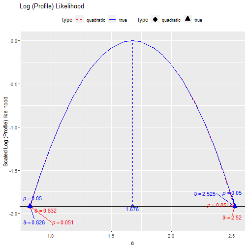
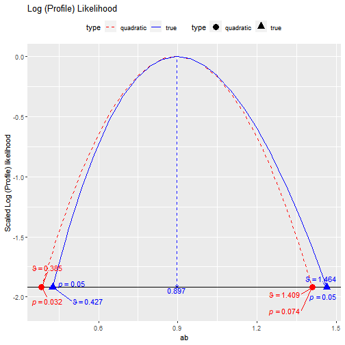

# Introduction

This vignette illustrates how to use
`loglike_compare()` to compare the
log profile likelihood of a parameter
in a structural equation model (SEM)
when it is fixed to a range of values
to that the log profile likelihood
approximated by a quadratic function,
using the method by Pawitan (2013)

# Limitations

The function `loglike_compare()`
and its helper functions
are for creating illustrative examples
and learning only, not for research use.
Therefore, they are not as versatile as
`semlbci()` in the types of models and
parameters supported. They can only
be used for free parameters and
user-defined parameters not involved in
any constraints. Only a model fitted by
maximum likelihood is supported. Last,
they will not check whether the
computation is appropriate for a model.
It is the responsibility of the users
to ensure that the computation is
appropriate for the model and parameter.

Despite these limitations, they are
still useful for generating graphs for
illustration and learning, their
intended use.

# Fitting a Simple Mediation model

Suppose a simple mediation model is
fitted to the dataset `simple_med`,
came with the package `semlbci`:


```r
library(lavaan)
#> This is lavaan 0.6-14
#> lavaan is FREE software! Please report any bugs.
library(semlbci)
dat <- simple_med
mod <-
"
m ~ a * x
y ~ b * m
ab := a * b
"
fit <- lavaan::sem(model = mod,
                   data = simple_med,
                   fixed.x = FALSE)
parameterEstimates(fit)
#>   lhs op rhs label    est    se      z pvalue ci.lower ci.upper
#> 1   m  ~   x     a  1.676 0.431  3.891  0.000    0.832    2.520
#> 2   y  ~   m     b  0.535 0.073  7.300  0.000    0.391    0.679
#> 3   m ~~   m       34.710 3.471 10.000  0.000   27.907   41.513
#> 4   y ~~   y       40.119 4.012 10.000  0.000   32.256   47.982
#> 5   x ~~   x        0.935 0.094 10.000  0.000    0.752    1.118
#> 6  ab := a*b    ab  0.897 0.261  3.434  0.001    0.385    1.409
```

# Log Profile likelihood Plots

## The *a*-path

To generate the plot for, say, the *a*-path coefficient,
we can simply call `loglike_compare()` and setting the
parameter to `"a"`.


```r
ll_a <- loglike_compare(fit,
                        par_i = "m ~ x")
#> 
#> Finding p-values for quadratic approximation
#> 
#> Finding p-values for LR test
```

Although teh *a*-path is labelled, `par_i` requires the
parameter specified in `lavaan::model.syntax`. Please
refer to the help page of `loglike_compare`.

By default, 21 values will used to generate the plot. This
can be controlled by the argument `n_points`.

Once finishes, we can simply use `plot()` to plot
the likelihood values:


```r
plot(ll_a)
```



As expected, the log profile likelihood of the *a*-path is
well-approximated by the quadratic approximation.

## The indirect effect

Let examine the log profile likelihood of the indirect
effect. To specify it, we need to use `ab :=`:


```r
ll_ab <- loglike_compare(fit,
                         par_i = "ab := ")
#> 
#> Finding p-values for quadratic approximation
#> 
#> Finding p-values for LR test
```

Note that it usually take longer for parameter which is
a nonlinear function of other parameters, such as an
indirect effect, which is the product of two other parameters.

This is the plot:


```r
plot(ll_ab)
```



We can see that, as expected, the quadratic approximation is
less satisfactory for the indirect effect.

Please refer to the help page of
`loglike_compare()` and its plot
method (`plot.loglike_compare()`),
for other available options.

# Final Remarks

The other functions, `loglike_range()`,
`loglike_point()`, `loglike_quad_range()`,
and `loglike_quad_point()` are helper
functions used by `loglike_compare()`.
They are exported such that interested
users can use them to compute the points
directly.

# Reference

Pawitan, Y. (2013). *In all likelihood: Statistical
#' modelling and inference using likelihood*. Oxford University Press.
